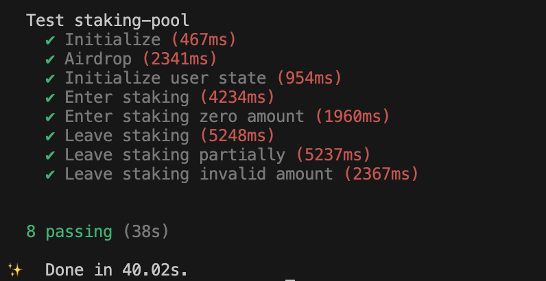

-   基本上实现了一个合约到测试的闭环。时间有点仓促，可能理解有偏差
-   合约实现接口
    -   initialize
    -   initialize_user_state
    -   airdrop
    -   enter_staking
    -   leave_staking
-   工具链版本
    -   Anchor: anchor-cli 0.30.1
    -   Solana: solana-cli 1.18.18 (src:83047136; feat:4215500110, client:SolanaLabs)
    -   Rustc: rustc 1.75.0 (82e1608df 2023-12-21)
-   编译: anchor build
-   测试: anchor test
-   测试截图

    
